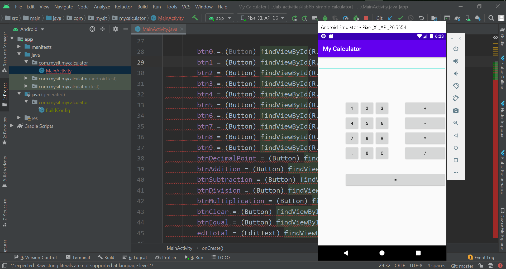

## Lab Activities

#### Lab Activity 1

#### Lab Activity 2

#### Lab Activity 3

#### Lab Activity 4

#### Lab Activity 5

#### Lab Activity 6a - Calculator
Retrieve from https://www.androidauthority.com/build-a-calculator-app-721910/

#### Lab Activity 6a - Simple calculator
Retrieve from https://crunchify.com/how-to-create-simple-calculator-android-app-using-android-studio/

#### Lab Activity 7c - WebView
Retrieved from https://developer.chrome.com/multidevice/webview/gettingstarted

